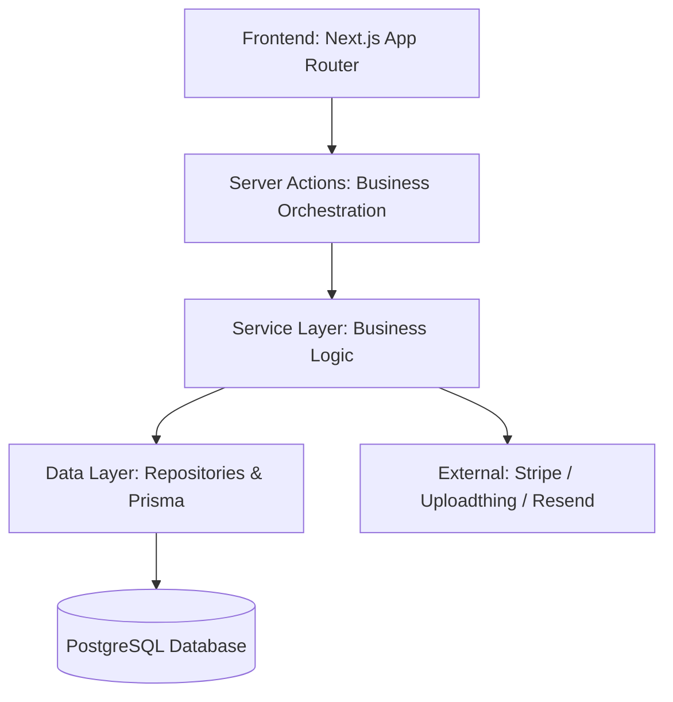
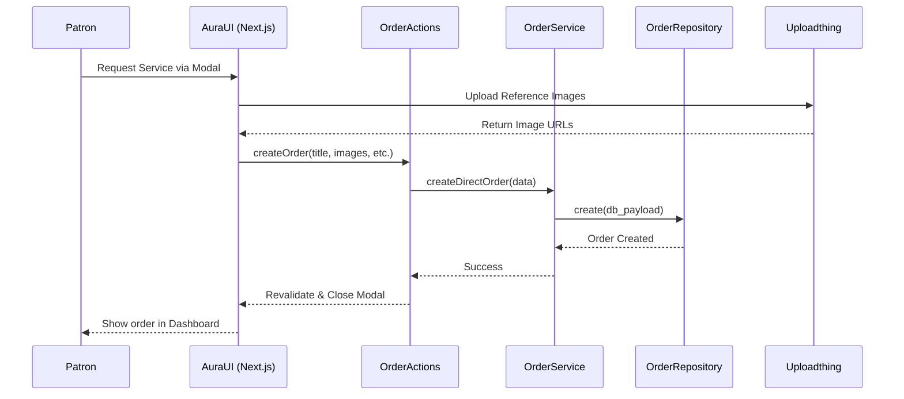
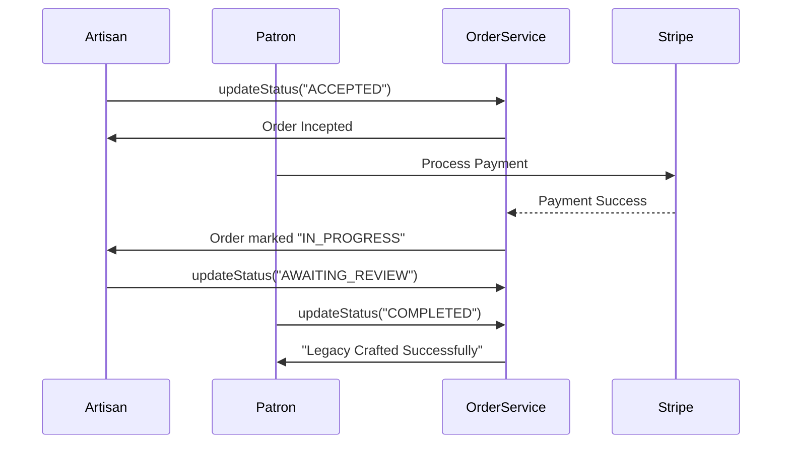

# 🧶 KalaSync: System Operations & Master Guide

Welcome to the modernized **KalaSync** marketplace. This document provides a comprehensive overview of how the system operates, the technical architecture, and instructions for running the platform.

---

## 🏛️ System Architecture

KalaSync uses a **Modular Hexagonal-Lite Architecture**, separating concerns into three distinct layers to ensure scalability and maintainability.



### 1. Data Layer (`/data`)
- **Repositories**: Direct interaction with Prisma. Handles data integrity and complex queries.
- **Example**: `userRepo.ts` fetches profiles and reviews in a single optimized query.

### 2. Service Layer (`/services`)
- **Domain Logic**: The "brains" of the app. Handles status transitions, notification triggers, and permission checks.
- **Example**: `orderService.ts` manages the order state machine (Pending -> Accepted -> Completed).

### 3. UI/Action Layer (`/app`, `/components`)
- **Server Actions**: Thin wrappers that call services and handle revalidation.
- **Modern UI**: Tailored with **Glassmorphism**, **3D Tilt Effects**, and **Aura Gold** accents.

---

## 🚀 Getting Started

### 📦 Prerequisites
- **Node.js**: v18.17.0 or higher.
- **PostgreSQL**: A running instance (local or hosted like Supabase/Neon).

### 🛠️ Installation

1. **Install Dependencies**:
   ```bash
   npm install
   ```

2. **Configure Environment (`.env`)**:
   Ensure your `.env` contains:
   ```env
   DATABASE_URL="postgresql://..."
   NEXTAUTH_SECRET="..."
   STRIPE_SECRET_KEY="..."
   UPLOADTHING_SECRET="..."
   ```

3. **Database Setup**:
   ```bash
   npx prisma db push
   npx prisma db seed
   ```

4. **Launch Development**:
   ```bash
   npm run dev
   ```

---

## 🔄 Core Workflows

### 1. Service Request & Inception
The interaction between the Patron (Customer) and the Artisan (Creator) is orchestrated through the action and service layers.



### 2. Order Lifecycle Management
How the status moves from initial request to a completed masterpiece.



### 3. Artisan Discovery (Public)
Users browse the **Find Artists** gallery. The UI uses `CreatorCard` with 3D hover effects to highlight elite talent. Metadata is dynamically generated for SEO on every profile.

### 4. Media & Assets
- **Uploadthing**: Powering the high-res reference image uploads.
- **Lucide Icons**: Providing a consistent, premium iconography set.

---

## 🎨 Design Philosophy: "KalaSync Luxury"
- **Obsidian Foundation**: Deep dark themes for focus and premium feel.
- **Aura Gold**: Used sparingly for high-value actions and typography.
- **Glassmorphism**: Backdrop blurs and subtle borders to create depth and sophistication.
- **Dynamic 3D**: Subtle motion that makes the interface feel "alive" and bespoke.

---

## 📚 Documentation Registry
For deeper dives, see the following artifacts in your `.gemini` directory:
- `architecture.md`: High-level system blueprints.
- `services_guide.md`: Detailed service-by-service API maps.
- `walkthrough.md`: History of major refactored features.
